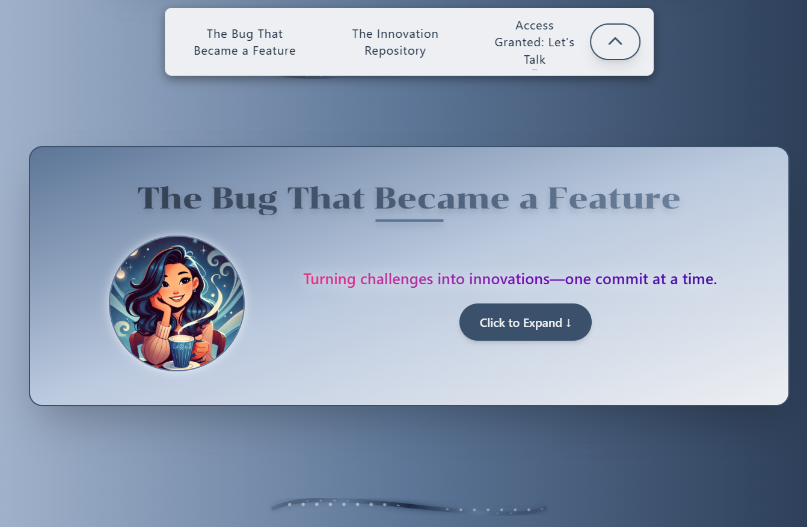
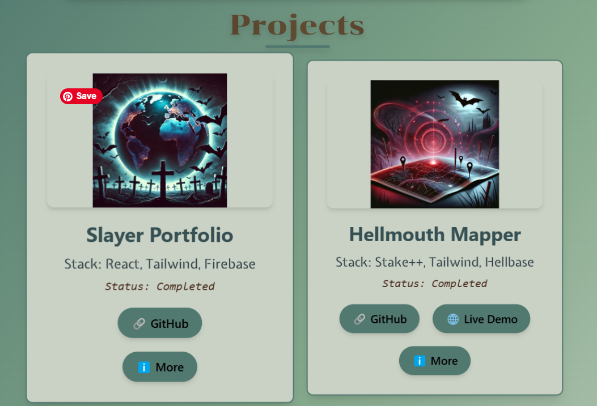

  

<h1 align="center">
  
</h1>

  
  

---

<h1 align="center">🛠️ Ctrl + Z Until It Works</h1>

  

I love solving **complex problems**, optimizing systems, and **turning bugs into features** (sometimes on purpose).  

With experience spanning **civil engineering, accounting, and software development**, I've learned to **adapt, ask the right questions, and build solutions that matter**. Whether it's **debugging an algorithm, architecting a system, or collaborating on a project**, I enjoy making things **work better than before**.  

I thrive in **hands-on learning environments**, where curiosity and experimentation drive innovation. My work blends **backend logic with intuitive front-end experiences**, and I’m always exploring **new ways to build, optimize, and scale software**.  

When I’m not coding, I’m avoiding **pinky toe-related injuries** 🦶💥 and ensuring my rescue pups 🐶 are living their best lives.

---

### **📈 Graphs That Make Me Look Productive**

  

---

<h1 align="center">🚀 Featured Projects</h1>

### 🎨 [My Portfolio](https://thechenfolio.web.app/)

  

  <strong>Built with:</strong> React, Tailwind CSS, Firebase  
   <strong>What it showcases:</strong> My projects, experience, and skills  
   <strong>Live Demo:</strong> <a href="https://thechenfolio.web.app/">Visit my site!</a>

---

### 🌱 [Sage Frame - Open Source Portfolio](https://github.com/lisa-chen-58/sage-frame-portfolio)

  

  <strong>Purpose:</strong> A fully customizable portfolio template for developers  
   <strong>Tech Stack:</strong> React, Tailwind CSS, Firebase  
   <strong>Live Demo:</strong> <a href="https://sage-frame.web.app/insertFormLink">Try it here!</a>  
   <strong>Contribute:</strong> Fork the repo and make it your own!

---

### 🐾 [Dog Info Site](#) (In Development)

  

  <strong>Purpose:</strong> A private site for my dog sitters with schedules & emergency info  
   <strong>Tech Stack:</strong> React, Firestore, Tailwind (Exploring Backend Development)  
   <strong>Features:</strong>  
   🔹 Secure access levels for different users  
   🔹 Real-time updates with Firestore  
   🔹 Role-based access control (e.g., sitters vs. general viewers)  

---

<h1 align="center">🔎 Currently Exploring</h1>

  <strong>Java & Algorithms</strong> for technical interviews  
   <strong>System Design Concepts</strong> to improve backend knowledge  
   <strong>Building a full-stack project</strong> with Firestore & React  

---

<h1 align="center">🛠 Tech Stack</h1>

  
  
  
  

<h1 align="center">🛠️ My Developer Toolkit</h1>

  
  
  
  
  

<h1 align="center">🌱 Growing My Skills</h1>

  
  
  
  

---
