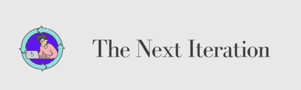
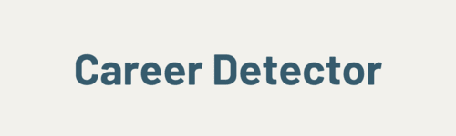

<!-- 

  

 -->

<h1 align="center">Welcome</h1>

  
  
	

<h1 align="center">About Me</h1>

I've had the privilege of navigating unique paths in life, taking four careers to discover my true passion: learning. Software development offers infinite possibilities and challenges, fueling my curiosity and drive to grow.

For me, the key is simple: keep learning, nurture connections, work hard, and enjoy the journey. Whether optimizing a process, contributing code, or collaborating with a team, I strive to make a positive impact while honing my skills.

When I'm not immersed in tech, I’m navigating life’s hazards—like keeping my pinky toe safe—and embracing every opportunity to grow as a developer, teammate, and lifelong learner.

<h1 align="center">Current Projects</h1>

<h1 align="center">Past Projects</h1>

	

This project represents a social server that hosts events and collaborations for developers. I created this group originally during my bootcamp days to connect students for collaborating on studies and other projects. Read more about us by navigating to our website!

	

 

	

<h4 align = "center">Pictures were modified by third-party applications</h4>

 

